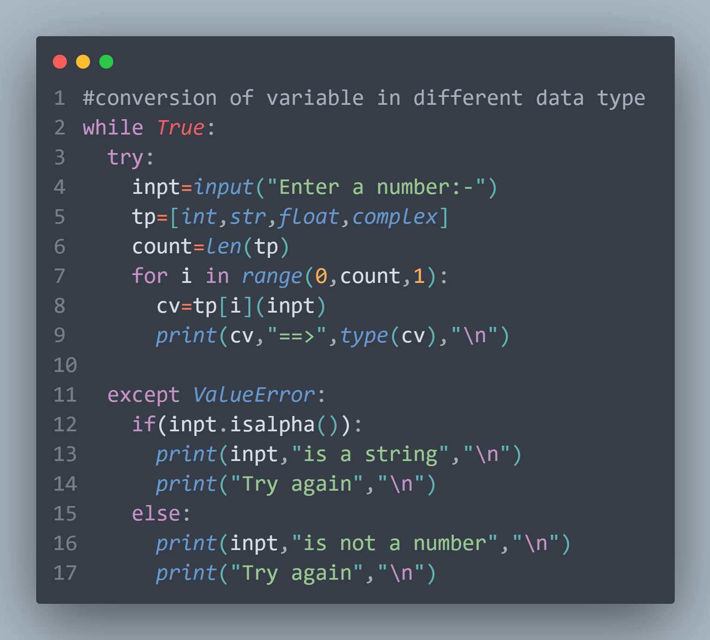
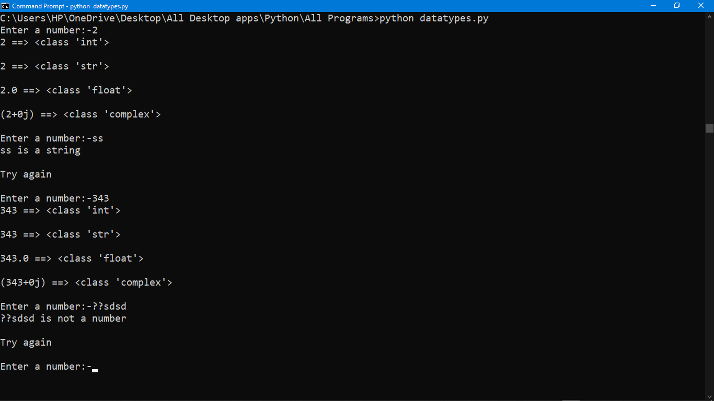

<h1 align="center">
   
  <b><i># Typecasting-Python</i></b>
</h1>
<h1>
Convert a input to different data types in python
</h1>

<h2>
  <i>
 

🚀 #You can Download, the 👆 FILE uploaded (typecasting.py)  and run it, you will get the same #OUTPUT 🚀

</i>
</h2> 
